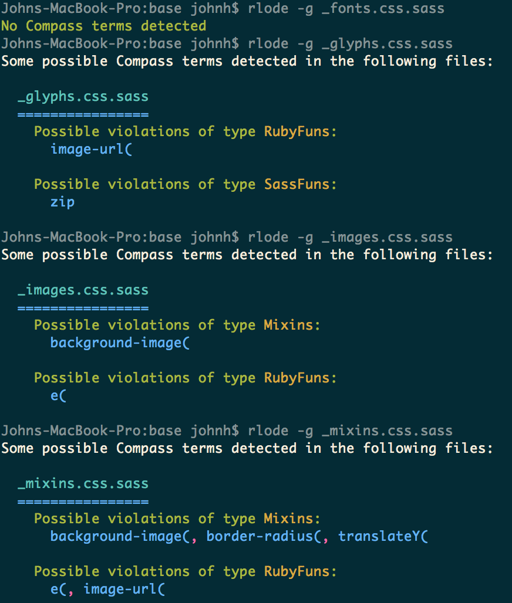

# ReverseLodestone
Lodestones are for compasses to find things.  Reverse lodestone is to help you find (and maybe remove) SASS Compass.

## Wut
I had to take Compass out of a well established product.  However, the extent of Compass' presence in the codebase was
not well understood.  So, I wrote a simple scanner to warn me where Compass was in the codebase, to facilitate its
safe removal.

## How do I use this
Simple.

```
npm install -g
rlode foo.sass
```



## Warning
Globbing is currently not correct, and will only check the first file globbed.  The reason is not yet clear to me.
Bugfixes are solicited.


Polemic :neckbeard:
-------------------

`ReverseLodestone` is MIT licensed, because viral licenses and newspeak language modification are evil.  Free is ***only*** free when it's free for everyone.
